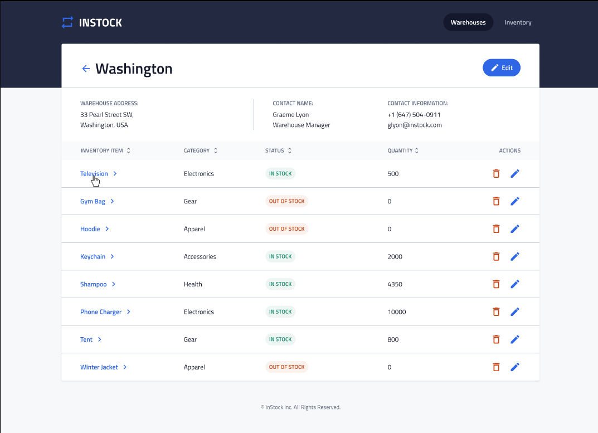
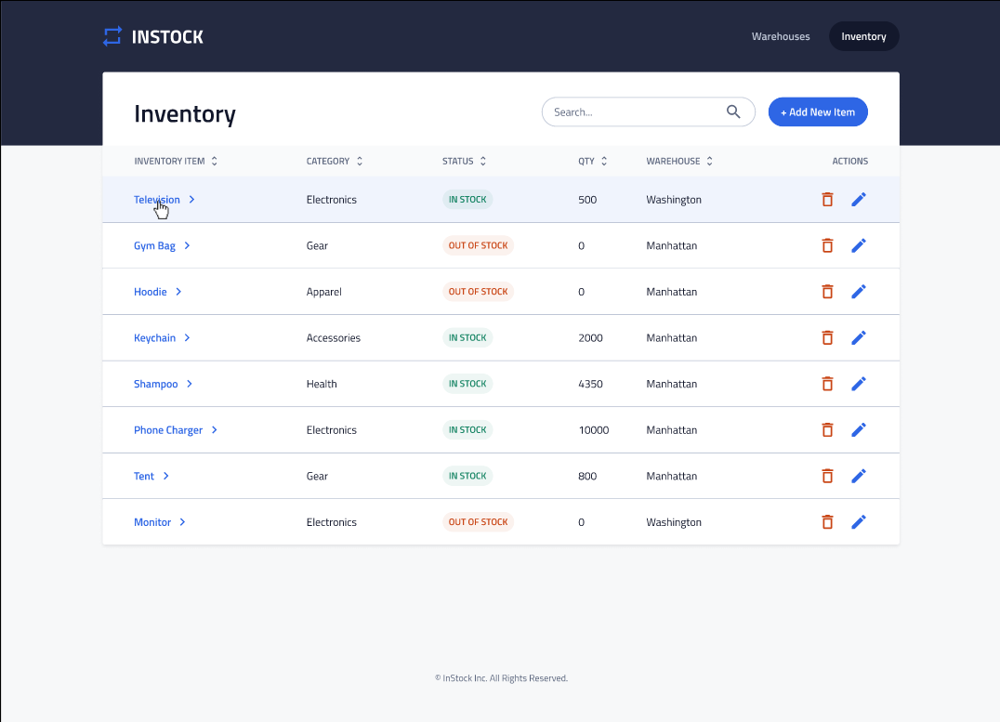
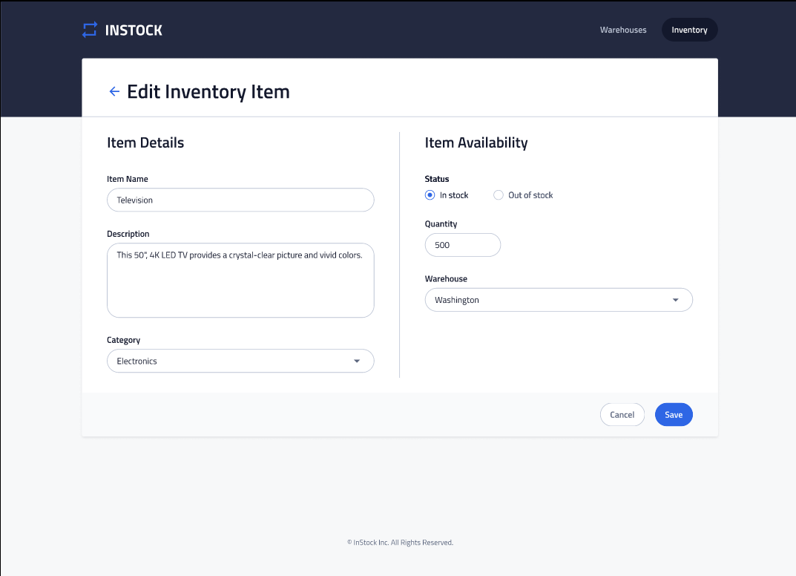
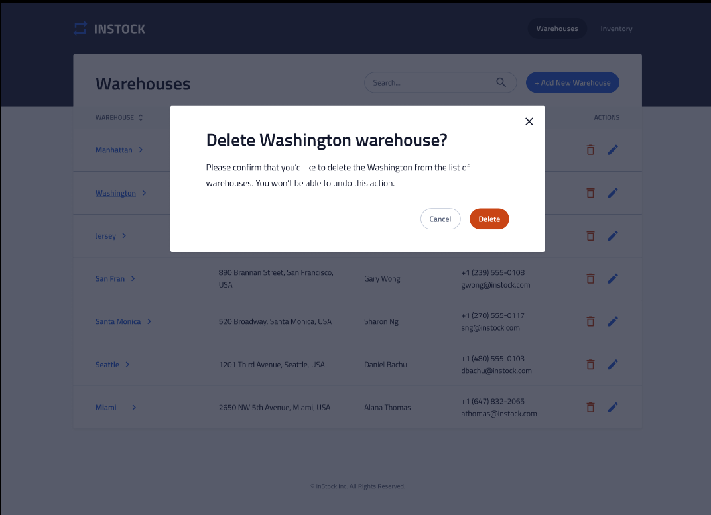

# Overview

A responsive collaborative project to develop warehouse inventories react web app enabling storage and tracking of inventory items across multiple warehouse locations. Implemented features allowing users to seamlessly add or edit inventory and warehouses, enhancing efficiency in inventory management.

# Implementation
### Tech Stack
- React
- MySQL
- Express
### Client libraries:
- react
- react-router
- axios
- scss

### Server libraries:
- knex
- express
- cors
- mysql2

## Demo

# Install with npm
npm install
npm start